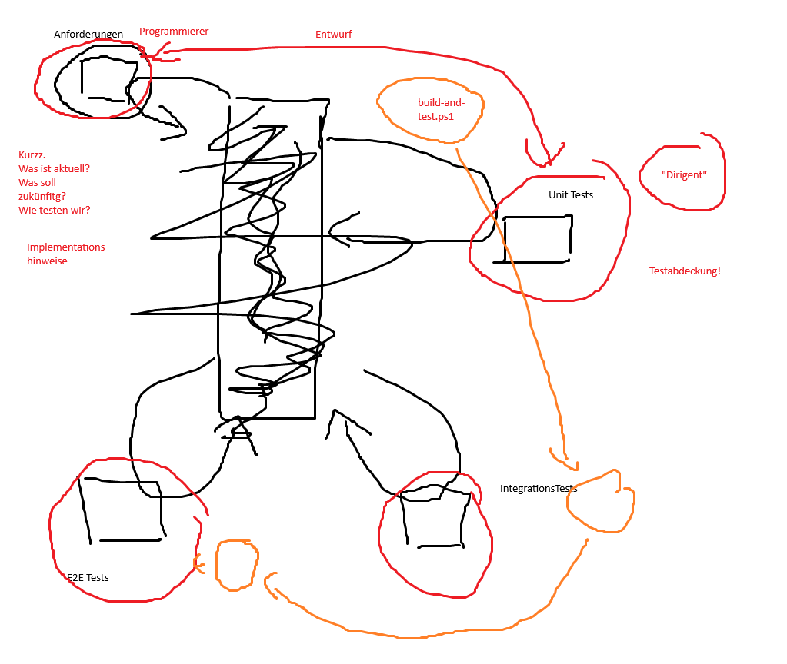

# Golden Cage .NET Template

Ein vollständiges, standardisiertes Template für .NET-Anwendungen mit KI-optimierter Entwicklung, automatisierten Scripts und umfassender Dokumentation.

## Überblick

Der "Golden Cage" ist ein produktionsreifes Verzeichnis-Template, das eine bewährte Struktur für .NET-Projekte bereitstellt. Jeder Hauptordner behandelt einen wichtigen Aspekt der Anwendungsentwicklung und bietet eine solide Grundlage für KI-gestützte Entwicklung mit vorgefertigten Scripts und Dokumentationen.



## Verzeichnisstruktur

```
GoldenCageDotNet/
├── CLAUDE.md                   # KI-Entwicklungsrichtlinien
├── Initialize-AI.md            # Schnelle KI-Initialisierung
├── Dokumentation/              # Projektdokumentation
│   ├── Anforderungen/          # Anforderungsanalyse (R00001-*.md)
│   ├── Architektur/            # CodeStyle & Patterns
│   ├── Commands/               # Standard KI-Prompts
│   └── Technologien/           # Framework-Dokumentation
├── Scripts/                    # PowerShell Automatisierung
│   ├── Build.ps1              # Umfassendes Build-System
│   ├── Database-Initialize.ps1 # DB Initialisierung/Clearing
│   ├── Database-Migrate.ps1   # Kontrollierte DB-Migration
│   ├── Run-Tests.ps1          # Unit & Integration Tests
│   └── Run-UITests.ps1        # UI-Tests (Playwright)
├── Source/                     # Quellcode
│   ├── Create-Solution.ps1    # .NET Solution Generator
│   ├── Code/                  # Hauptanwendungscode
│   └── DBMigrations/          # SQL-basierte Migrationen
│       └── README.md          # Migrations-Dokumentation
├── Tests/                     # Test-Suite
│   ├── Datenbank/             # Datenbank-Tests
│   │   └── README.md          # DB-Test Dokumentation
│   └── UI/                    # Playwright UI-Tests
│       └── README.md          # UI-Test Dokumentation
└── README.md                  # Diese Datei
```

## Hauptordner im Detail

### 🤖 KI-Integration
- **CLAUDE.md**: Entwicklungsrichtlinien für KI-Assistenten
- **Initialize-AI.md**: Schnelle Initialisierungsbefehle für KI-Tools

### 📋 Dokumentation/
Zentrale Stelle für alle projektbezogene Dokumentation:
- **Anforderungen/**: Strukturierte Anforderungen (R00001-*.md Format)
- **Architektur/**: CodeStyle, Programmier-Patterns und Design-Entscheidungen
- **Commands/**: Standard KI-Prompts (Security-Review, Code-Quality, etc.)
- **Technologien/**: Framework-spezifische Dokumentation

### ⚙️ Scripts/
Produktionsreife PowerShell-Automatisierung:
- **Build.ps1**: Vollständiges Build-System mit Multi-Framework Support
- **Database-Initialize.ps1**: Datenbank-Initialisierung und Clearing
- **Database-Migrate.ps1**: Kontrollierte Migration mit Rollback-Support
- **Run-Tests.ps1**: Unit & Integration Test Runner
- **Run-UITests.ps1**: Playwright UI-Test Ausführung

### 💻 Source/
Strukturierter Anwendungscode:
- **Create-Solution.ps1**: Automatischer .NET Solution Generator
- **Code/**: Hauptanwendungslogik, APIs, Services und Business Logic
- **DBMigrations/**: SQL-basierte Migrationen (00001-beschreibung.sql Format)

### 🧪 Tests/
Umfassende Test-Suite mit Dokumentation:
- **Datenbank/**: Schema-, Migration- und Performance-Tests
- **UI/**: Playwright-basierte UI-Tests mit Page Object Model

## Schnellstart

### 1. Neue .NET Solution erstellen
```powershell
# Erstelle eine neue WebAPI Solution
.\Source\Create-Solution.ps1 -SolutionName "MeinProjekt" -ProjectType "WebApi"

# Erstelle eine Blazor Server Anwendung
.\Source\Create-Solution.ps1 -SolutionName "MeinBlazorApp" -ProjectType "BlazorServer" -AddDockerSupport
```

### 2. KI-Assistent initialisieren
```bash
# Vollständige Projekt-Initialisierung für KI
cat Initialize-AI.md

# Oder verwende die Kommandos direkt
cat README.md
cat CLAUDE.md
find ./Dokumentation/Anforderungen -name "*.md" -exec cat {} \;
```

### 3. Entwicklungsworkflow
```powershell
# Build der gesamten Solution
.\Scripts\Build.ps1 -Configuration "Release" -Clean

# Datenbank initialisieren
.\Scripts\Database-Initialize.ps1 -DatabaseName "MeinProjekt" -Initialize

# Tests ausführen
.\Scripts\Run-Tests.ps1 -All -Coverage

# UI-Tests mit Screenshots
.\Scripts\Run-UITests.ps1 -Browser "Chrome" -Screenshots
```

## Produktionsmerkmale

### ✅ **Vollautomatisierte Scripts**
- Produktionsreife PowerShell-Scripts für alle Entwicklungsaufgaben
- Multi-Browser UI-Testing mit Playwright
- Umfassende Datenbank-Migration mit Rollback-Support

### ✅ **KI-optimierte Entwicklung**
- Strukturierte Dokumentation für optimale KI-Zusammenarbeit
- Standard-Prompts für Code-Reviews und Qualitätssicherung
- Schnelle Initialisierung mit vorgefertigten Kommandos

### ✅ **Enterprise-ready Testing**
- Schema-, Migration- und Performance-Tests für Datenbanken
- Page Object Model für stabile UI-Tests
- Testcontainers für isolierte Integrationstests

### ✅ **Dokumentations-zentriert**
- Strukturierte Anforderungen (R00001-*.md Format)
- Architektur- und Technologie-Dokumentation
- Versionierte Migrations-Dokumentation

### ✅ **Skalierbare Struktur**
- Template-basierte Solution-Generierung
- Modulare Test-Architekturen
- Standardisierte Projekt-Organisation

## Verfügbare Scripts

| Script | Beschreibung | Beispiel |
|--------|-------------|----------|
| `Build.ps1` | Umfassendes Build-System | `.\Scripts\Build.ps1 -Clean -Publish` |
| `Database-Initialize.ps1` | DB Setup/Clear | `.\Scripts\Database-Initialize.ps1 -Initialize` |
| `Database-Migrate.ps1` | Kontrollierte Migration | `.\Scripts\Database-Migrate.ps1 -TargetMigration "00005"` |
| `Run-Tests.ps1` | Unit/Integration Tests | `.\Scripts\Run-Tests.ps1 -All -Coverage` |
| `Run-UITests.ps1` | Playwright UI-Tests | `.\Scripts\Run-UITests.ps1 -Browser "Firefox" -Headless` |
| `Create-Solution.ps1` | Solution Generator | `.\Source\Create-Solution.ps1 -SolutionName "App" -ProjectType "WebApi"` |

## KI-Integration

### Standard-Prompts verfügbar:
- **Security-Review**: `cat ./Dokumentation/Commands/Security-Review.md`
- **Code-Quality**: `cat ./Dokumentation/Commands/Code-Quality.md`
- **Architektur-Prüfung**: `cat ./Dokumentation/Commands/Architektur-Pruefung.md`

### Schnelle KI-Initialisierung:
```bash
# Für vollständigen Kontext
cat Initialize-AI.md | bash

# Für spezifische Bereiche
cat ./Dokumentation/Anforderungen/README.md
cat ./Dokumentation/Architektur/CodeStyle.md
```

## Technologie-Stack

- **.NET 8.0**: Modern C# Development
- **Entity Framework Core**: ORM und Migrations
- **Playwright**: Cross-Browser UI Testing
- **NUnit**: Unit Testing Framework
- **FluentAssertions**: Readable Test Assertions
- **PowerShell**: Cross-Platform Automation

---

**Golden Cage .NET Template** - Produktionsreifes Template für moderne .NET-Entwicklung mit KI-Integration.